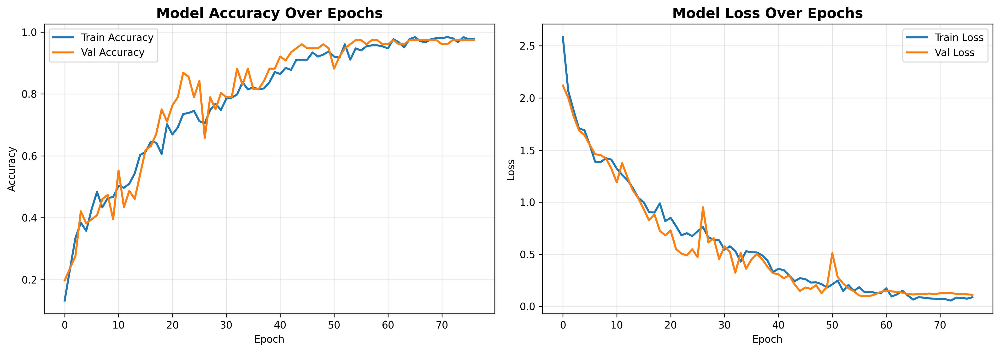
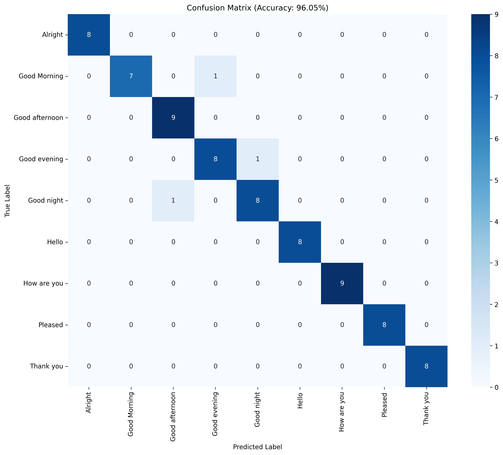

# ✋ SignAI — AI-Powered Indian Sign Language Transcription System

<div align="center">


### AI-Powered Indian Sign Language Recognition using MediaPipe, GCNs, BiLSTMs & LLMs

</div>

---

# 👨‍💻 Team Byte_Coders

## Team Lead

* **Shinjan Saha**

## Members

* **Satyabrata Das Adhikari**
* **Sayan Sk**

---

# 📌 Project Overview

**SignAI** is a modern AI-powered **Indian Sign Language (ISL) transcription platform** that converts sign language gestures into readable human language using:

* 🧠 Graph Neural Networks (GCN)
* 🔄 Bidirectional LSTMs
* ✋ MediaPipe skeletal landmark extraction
* 🤖 LLM-powered sentence reconstruction

The system supports:

✔️ Real-time webcam-based sign detection

✔️ Video upload inference

✔️ Spatial skeletal understanding

✔️ Temporal gesture modeling

✔️ Human-readable sentence generation

✔️ Premium UI-based interaction

---

# ⚡ Key Features

| Feature                     | Description                               |
| --------------------------- | ----------------------------------------- |
| 🎥 Real-Time Detection      | Webcam-based live ISL transcription       |
| 📁 Video Inference          | Upload videos for offline prediction      |
| 🧠 GCN + BiLSTM             | Spatial + temporal deep learning pipeline |
| ✋ MediaPipe Holistic        | Hand & pose skeletal landmark extraction  |
| 🤖 AI Sentence Generation   | LLM reconstructs natural human sentences  |
| 📊 Confidence Visualization | Top-k prediction probabilities            |

---

# 🏗️ AI Architecture

## 1️⃣ MediaPipe Landmark Extraction

The system extracts:

* Left hand landmarks
* Right hand landmarks
* Pose landmarks

Each video becomes:

```text
60 Frames × 258 Features
```

The pipeline includes:

* Relative normalization
* Wrist-origin scaling
* Shoulder-width normalization
* Temporal padding/truncation
* Augmentation

---

## 2️⃣ Graph Construction

The skeletal graph consists of:

| Component  | Joints   |
| ---------- | -------- |
| Left Hand  | 21       |
| Right Hand | 21       |
| Pose       | 33       |
| Total      | 75 Nodes |

Edges model:

* Finger connections
* Palm structure
* Pose skeleton
* Cross-body wrist links

---

## 3️⃣ Graph Convolutional Network (GCN)

GCNs learn spatial relationships between joints.

The model extracts:

* Finger articulation patterns
* Relative body geometry
* Hand-shape semantics
* Spatial gesture understanding

Architecture:

```text
GCN Layer 1 → 64 Features
GCN Layer 2 → 128 Features
```

---

## 4️⃣ Bidirectional LSTM

BiLSTMs model temporal gesture dynamics.

Architecture:

```text
BiLSTM (256 Units)
        ↓
BiLSTM (128 Units)
```

This captures:

* Gesture motion flow
* Timing relationships
* Sequential dependencies
* Future + past context

---

## 5️⃣ AI Sentence Reconstruction

Current sign language models mainly predict isolated words.

SignAI integrates:

```text
Gemini API + LangChain
```

to convert predicted tokens into:

* grammatically coherent
* contextual
* readable human language

Example:

```text
Predicted Words:
[I, go, market, tomorrow]

LLM Output:
I will go to the market tomorrow.
```

---

# 📊 Training Pipeline

The training workflow includes:

✔️ Frame-level augmentation

✔️ Temporal augmentation

✔️ Landmark normalization

✔️ Landmark-level augmentation

✔️ Class balancing

✔️ Early stopping

✔️ Learning rate scheduling

---

# ⚙️ Training Configuration

| Parameter       | Value                    |
| --------------- | ------------------------ |
| Sequence Length | 60                       |
| Input Features  | 258                      |
| Optimizer       | Adam                     |
| Loss Function   | Categorical Crossentropy |
| Epochs          | 100                      |
| Batch Size      | 16                       |

---

# 📈 Output Visualizations

## 🔥 Training History

```text
outputs/training_history.png
```

Tracks:

* Training accuracy
* Validation accuracy
* Training loss
* Validation loss

---

## 📊 Confusion Matrix

```text
outputs/confusion_matrix.png
```

Displays:

* Class-level predictions
* Misclassification patterns
* Generalization performance

---

# 🌐 Full Stack Architecture

```text
Frontend Webcam Stream
        ↓
Flask Backend API
        ↓
MediaPipe Landmark Extraction
        ↓
GCN + BiLSTM Inference
        ↓
Prediction Sequence
        ↓
Gemini Sentence Reconstruction
        ↓
Frontend Output
```

---

# 🛠️ Tech Stack

## Frontend

| Technology    | Purpose            |
| ------------- | ------------------ |
| React + Vite  | Frontend framework |
| Tailwind CSS  | Styling            |
| Framer Motion | Animations         |
| Axios         | API communication  |

---

## Backend

| Technology         | Purpose               |
| ------------------ | --------------------- |
| Flask              | Backend API           |
| TensorFlow / Keras | Deep learning         |
| OpenCV             | Video processing      |
| MediaPipe          | Landmark extraction   |
| NumPy              | Numerical computation |

---

## AI / ML

| Technology | Purpose                    |
| ---------- | -------------------------- |
| GCN        | Spatial skeletal learning  |
| BiLSTM     | Temporal sequence modeling |
| LangChain  | LLM orchestration          |
| Gemini API | Sentence generation        |

---

# 📁 Repository Structure

```text
SignAI/
│
├── backend/                                # Flask backend API + inference server
│   ├── app.py                              # Main backend server and prediction routes
│   └── requirements.txt
│
├── frontend/                               # React + Vite frontend application
│   ├── src/
│   │   ├── components/                     # Reusable UI components
│   │   │
│   │   ├── pages/                          # Main application pages
│   │   │   ├── Home.jsx                    # Landing page
│   │   │   ├── About.jsx                   # Project overview page
│   │   │   ├── Detection.jsx               # Real-time sign detection page
│   │   │   └── Signs.jsx                   # Supported sign classes page
│   │   │
│   │   ├── App.jsx                         # Main React application
│   │   └── main.jsx                        # React entry point
│   │
│   ├── package.json                        # Frontend dependencies
│   ├── vite.config.js
│   └── tailwind.config.js
│
├── outputs/                                # Training and evaluation outputs
│   ├── confusion_matrix.png                # Confusion matrix visualization
│   ├── training_history.png                # Accuracy/loss training curves
│   ├── processed_landmarks.pkl             # Preprocessed landmark dataset
│   ├── best_isl_model.keras                # Saved trained BiLSTM model
│   └── best_isl_gcn_model.keras            # Best trained GCN model
│
├── Indian Sign Language Greetings Dataset/ # Dataset directory
│
├── ISL_transcription.ipynb                 # Complete training + research notebook
├── live_detection.py                       # Webcam-based live detection script
├── README.md                               # Project documentation
└── requirements.txt                        # Root dependencies
```

---

# 🚀 Local Setup

## 1️⃣ Clone Repository

```bash
git clone https://github.com/Code-r4Life/SignAI.git
cd SignAI
```

---

# ⚙️ Backend Setup

```bash
cd backend
pip install -r requirements.txt
```

Create `.env`

```env
GEMINI_API_KEY=your_api_key_here
```

Run backend:

```bash
python app.py
```

---

# 🌐 Frontend Setup

```bash
cd frontend
npm install
npm run dev
```

---

# 🎥 Run Live Detection

```bash
python live_detection.py
```

Controls:

```text
SPACE → Start / Stop Recording
Q → Quit Application
```

---

# 🖼️ Training & Evaluation Visualizations

## 📊 Training History

The following graph shows:

- Training Accuracy
- Validation Accuracy
- Training Loss
- Validation Loss

This helps analyze:

- model convergence
- overfitting
- learning stability

<div align="center">



</div>

---

## 🔥 Confusion Matrix

The confusion matrix visualizes:

- class-wise predictions
- model confusion patterns
- classification performance

<div align="center">



</div>

---

# 📬 Interested in a Similar Project?

I build smart, ML-integrated applications and responsive web platforms. Let’s build something powerful together!

📧 shinjansaha00@gmail.com

🔗 [LinkedIn Profile](https://www.linkedin.com/in/shinjan-saha-1bb744319/)